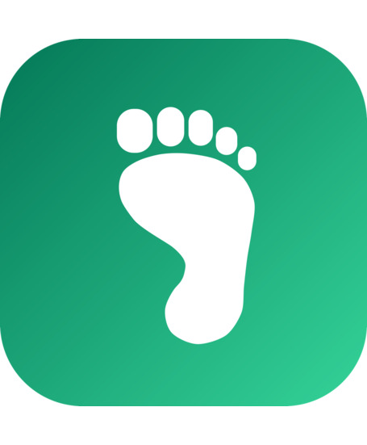

# Super Greenfoot

Super Greenfoot is a modified Greenfoot remix by Jordan Cohen, based on the
[Greenfoot 3.9.0 source release](https://github.com/k-pet-group/BlueJ-Greenfoot)
(tag `GREENFOOT-RELEASE-3.9.0`). The original Greenfoot was created by Michael
Kölling and Poul Henriksen. This fork is not an official Greenfoot release.

The project is distributed under the GNU General Public License version 2 with
the Classpath Exception. See [LICENSE.txt](LICENSE.txt) for the full terms and
[splash artwork credits](docs/branding/SPLASH_CREDITS.md) and
[About artwork credits](docs/branding/ABOUT_CREDITS.md) for image sources and
modification notices. The [macOS installer artwork](docs/branding/DMG_CREDITS.md)
has its own editable DrawSimple source and provenance notes.

## Download

**[Super Greenfoot 0.1.0 for macOS](https://github.com/MrCohen/SuperGreenfoot/releases/tag/v0.1.0)**
is the first public release. Download the `.dmg`, open it, and drag
Super Greenfoot into Applications. The app is signed and notarized, so it opens
without security warnings. Java is included; nothing else needs installing.

It needs a Mac with Apple Silicon (M1 or later) and macOS 11 or later. It
installs next to the original Greenfoot and does not replace it.

| Platform | Status |
|---|---|
| macOS, Apple Silicon | Installer available |
| macOS, Intel | Run from source (below); installer planned |
| Windows | Run from source (below); installer forthcoming |
| Linux | Run from source (below); installer forthcoming |

Development currently happens on a Mac, which is why the Mac installer came
first. Windows and Linux installers are on the [plan](MASTER_PLAN.md).

## What it adds to Greenfoot 3.9.0

Every existing Greenfoot scenario keeps working unchanged. New in this release:

- **Precise movement**: `double` positions and rotation on `Actor`, with optional smooth sub-pixel rendering.
- **Per-actor depth**: `setZ`, sort-by-y for faux 3D, without touching act order.
- **Text metrics**: measure strings and draw centred text.
- **A real sound engine**: a software mixer, overlapping effects, volume, pan, categories and music, through the new `Sounds` class. `GreenfootSound` still works and shares the mixer.
- **Full screen play** in the IDE and in exported games, with a display API that scenario code can drive.
- **Export as a desktop application**: a runnable `.jar`, or on macOS a native `.app` that can be signed and notarized.
- **A `Save` API** without slot limits for local game saves.

API details are in [docs/api](docs/api). Example scenarios are in
[super-scenarios](super-scenarios). Web export and an online gallery are
planned and not part of this release.

## Running on Windows, Linux or an Intel Mac

There is no installer for these yet, but Super Greenfoot runs from source
with one extra step. You need [git](https://git-scm.com/) and a Java 21 JDK,
for example [Eclipse Temurin 21](https://adoptium.net/temurin/releases/?version=21).
Gradle and JavaFX download themselves on the first run.

macOS or Linux:

```sh
git clone --depth 1 --branch v0.1.0 https://github.com/MrCohen/SuperGreenfoot.git
cd SuperGreenfoot
./gradlew runGreenfoot -x test
```

Windows (Command Prompt or PowerShell):

```bat
git clone --depth 1 --branch v0.1.0 https://github.com/MrCohen/SuperGreenfoot.git
cd SuperGreenfoot
gradlew.bat runGreenfoot -x test
```

If `java -version` does not report 21, set `JAVA_HOME` to the JDK 21 folder
first. The first start downloads dependencies and compiles, which takes a few
minutes. Later starts take well under a minute.

What to expect on these platforms:

- The source build and the test suite run on Linux on every push (GitHub
  Actions). Windows and Intel Macs use the same upstream Greenfoot build, which
  supports them, but this fork has not been tested there yet. Please
  [open an issue](https://github.com/MrCohen/SuperGreenfoot/issues) if something fails.
- Exporting a game as a runnable `.jar` works everywhere, and the jar runs on
  any computer with Java 21.
- Exporting a native application package has only been verified from the
  installed Mac app so far.

Developers on a Mac can also use the `dev` helper script; see
[DEV_SCRIPT_INSTRUCTIONS.md](DEV_SCRIPT_INSTRUCTIONS.md).

The original upstream README follows.

---




# BlueJ and Greenfoot

BlueJ and Greenfoot are integrated development environments (IDE) aimed at novices.  They support the use of the Java programming language, as well as the frame-based Stride language.

BlueJ and Greenfoot are maintained by Michael Kölling and his research group at King's College London.

Further details and installers
---

More details about BlueJ and Greenfoot, and pre-built installers for each, are available on the main webpages:
 - <a href="https://www.bluej.org/">BlueJ</a>
 - <a href="https://www.greenfoot.org/">Greenfoot</a>

License
---

This repository contains the source code for BlueJ and Greenfoot, licensed under the GPLv2 with classpath exception (see [LICENSE.txt](LICENSE.txt)).

Building and running
---

BlueJ uses Gradle as its automated build tool.  To build you will first need to install a Java (21) JDK.  Check out the repository then execute the following command to run BlueJ:

```
./gradlew runBlueJ
```

Or to run Greenfoot:

```
./gradlew runGreenfoot
```

Development
---

To work on the project, IntelliJ IDEA should import the Gradle project automatically, although you may need to set the JDK (21) and language level (also 21).

Contributing
---

We accept pull requests for translations or bug fixes.  If you plan to add a new feature or change existing behaviour we advise you to get in contact with us first, as we are likely to refuse any pull requests which are not part of our roadmap for BlueJ/Greenfoot.  One of the reasons for BlueJ and Greenfoot's success is their simplicity, which has been achieved by being very conservative in which features we choose to add.  

Building Installers
---

The installers are built automatically on Github.  If you want to build them manually you will need to set any appropriate tool paths in tools.properties, and run the appropriate single command of the following set:

```
./gradlew packageBlueJWindows
./gradlew packageBlueJLinux
./gradlew packageBlueJMacIntel
./gradlew packageBlueJMacAarch
./gradlew packageGreenfootWindows
./gradlew packageGreenfootLinux
./gradlew packageGreenfootMacIntel
./gradlew packageGreenfootMacAarch
```

None of the installers can be cross-built, so you must build Windows on Windows, Mac on Mac and Linux on Debian/Ubuntu.  Windows requires an installation of WiX 3.10 and MinGW64 to build the installer.  On Mac, JAVA_HOME must point to an Intel JDK for the Intel build, and an Aarch/ARM JDK for the Aarch build, so you cannot run them in the same command.
