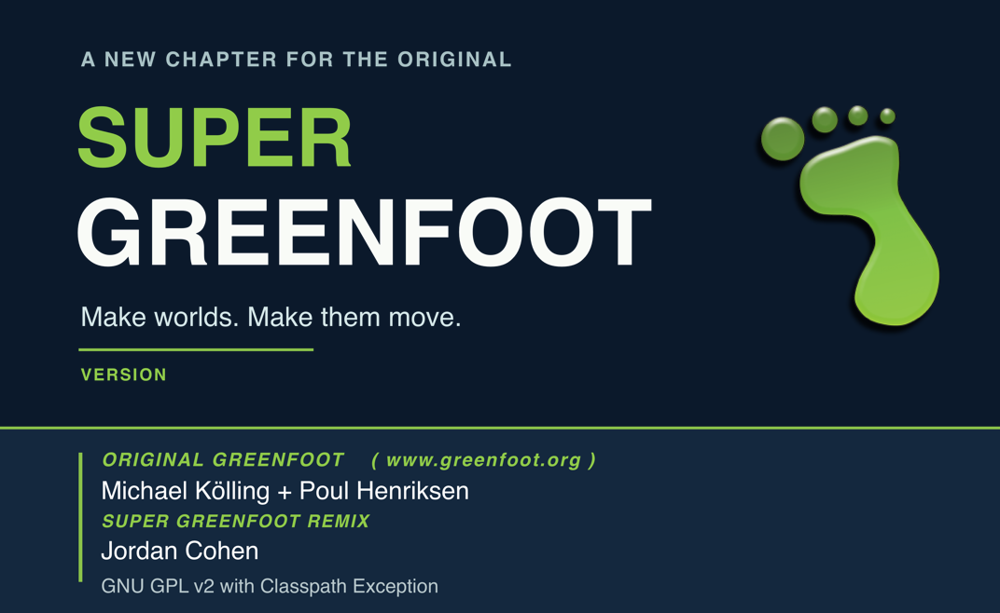
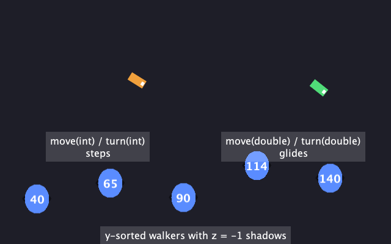

<p align="center">
  
</p>

<p align="center">
  <a href="https://github.com/MrCohen/SuperGreenfoot/releases/latest"></a>
  <a href="https://github.com/MrCohen/SuperGreenfoot/actions/workflows/build-and-run-tests.yml"></a>
  <a href="LICENSE.txt"></a>
</p>

# Super Greenfoot

Super Greenfoot is [Greenfoot](https://www.greenfoot.org/), the friendly Java
environment for making games and simulations, with the features my students
kept asking for: smooth movement, layers, proper sound, full screen, and a way
to turn a finished game into a real app.

Everything you already know still works. Open your existing Greenfoot
scenarios and they run exactly as before. The new features are there when you
want them.

Made by Jordan Cohen, a high school computer science teacher, for classroom
use and for anyone else who finds it helpful. It is a remix of Greenfoot 3.9.0
and is not an official Greenfoot release.

## Get it

### Mac

**[Download Super Greenfoot for macOS](https://github.com/MrCohen/SuperGreenfoot/releases/latest)**

1. Download the `.dmg` file from the release page.
2. Open it and drag Super Greenfoot into Applications.
3. Start it from Applications.

The app is signed and notarized by Apple, so it opens without security
warnings. Java is included, so there is nothing else to install. It needs a Mac
with Apple Silicon (M1 or later) and macOS 11 or later. It sits next to the
original Greenfoot and does not replace it.

### Windows, Linux and Intel Macs

Development currently happens on a Mac, so the Mac installer came first.
Windows and Linux installers are on the way. Until then, Super Greenfoot runs
from source with [one extra step](#run-from-source).

| Platform | Status |
|---|---|
| macOS, Apple Silicon | Installer available |
| macOS, Intel | [Run from source](#run-from-source); installer planned |
| Windows | [Run from source](#run-from-source); installer forthcoming |
| Linux | [Run from source](#run-from-source); installer forthcoming |

## What is new

<p align="center">
  <br>
  <em>PrecisionDemo, one of the included example scenarios.</em>
</p>

| | |
|---|---|
| **Smooth movement** | Actors can sit at `double` positions and turn by fractions of a degree. No more helper classes to avoid jerky motion. |
| **Layers** | Give any actor a depth with `setZ`, or let the world sort by height on screen for a 3D look. |
| **Real sound** | Play the same effect many times at once, set volume and pan, loop music, and mute whole categories. |
| **Full screen** | Play full screen in the IDE and in exported games. Your code can switch it on and choose how the picture scales. |
| **Export as an app** | Share a game as a runnable `.jar`, or on a Mac as a signed `.app`. |
| **Saving** | Store scores and progress with simple `Save.putInt` and `Save.getInt` calls, with no slot limits. |
| **Text measuring** | Find the width and height of text, and draw it centred, without scanning pixels. |

A taste of the new calls:

```java
public class Ship extends Actor
{
    public void act()
    {
        move(2.5);          // fractions of a pixel
        turn(0.75);         // fractions of a degree
        setZ(getY());       // lower on screen draws in front

        if (Greenfoot.isKeyDown("space")) {
            Sounds.play("laser");   // overlaps with itself, no cut-offs
        }
    }
}
```

```java
public class Space extends World
{
    public Space()
    {
        super(960, 540, 1);
        setSmoothRendering(true);           // draw at precise positions
        Sounds.load("laser", "laser.wav");
        Save.putInt("visits", Save.getInt("visits", 0) + 1);
    }
}
```

To learn more:

- Try the example scenarios in [super-scenarios](super-scenarios): PrecisionDemo, SoundDemo and DisplayDemo.
- Read the API notes in [docs/api](docs/api).

Web export, an online gallery, and online high scores are planned and are not
part of this release. The [master plan](MASTER_PLAN.md) shows what is coming.

## Run from source

This works on Windows, Linux and any Mac. You need two things installed:

- [git](https://git-scm.com/)
- A Java 21 JDK, for example [Eclipse Temurin 21](https://adoptium.net/temurin/releases/?version=21)

Then, on macOS or Linux:

```sh
git clone --depth 1 --branch v0.1.0 https://github.com/MrCohen/SuperGreenfoot.git
cd SuperGreenfoot
./gradlew runGreenfoot -x test
```

On Windows, in Command Prompt or PowerShell:

```bat
git clone --depth 1 --branch v0.1.0 https://github.com/MrCohen/SuperGreenfoot.git
cd SuperGreenfoot
gradlew.bat runGreenfoot -x test
```

Everything else downloads itself. The first start takes a few minutes while
it downloads and compiles. After that it starts in well under a minute. Run
the last command again whenever you want to open Super Greenfoot.

If `java -version` does not report 21, set `JAVA_HOME` to the JDK 21 folder
first.

What to expect:

- The source build and the tests run on Linux on every change. Windows and
  Intel Macs use the same build as the original Greenfoot, which supports
  them, but Super Greenfoot has not been tested there yet.
- Exporting a game as a runnable `.jar` works everywhere. The jar runs on any
  computer with Java 21.
- Exporting a native app has only been verified from the installed Mac app so far.

## Questions and feedback

Found a bug, or have an idea? Please
[open an issue](https://github.com/MrCohen/SuperGreenfoot/issues/new/choose).
Reports from Windows and Linux are especially welcome right now. You do not
need to be a programmer to report something: say what you did, what you
expected, and what happened.

**Will my old scenarios work?** Yes. The existing Greenfoot API is unchanged,
and keeping old scenarios working is a rule of the project.

**Can I open a Super Greenfoot scenario in the original Greenfoot?** Only if
it does not use the new features. Scenarios that call the new methods need
Super Greenfoot.

**Is this connected to the Greenfoot Gallery?** No. Super Greenfoot is a
separate project. Its own way to share games on the web is planned.

## For developers

- [MASTER_PLAN.md](MASTER_PLAN.md) has the roadmap and the decisions behind it.
- [DEV_SCRIPT_INSTRUCTIONS.md](DEV_SCRIPT_INSTRUCTIONS.md) covers the `dev` helper script for building, testing and packaging on a Mac.
- [docs/provenance.md](docs/provenance.md) lists every upstream file this fork changes.

## Credits and license

Greenfoot was created by Michael Kölling and Poul Henriksen and is maintained
by the [BlueJ and Greenfoot team](https://www.greenfoot.org/) at King's College
London. Super Greenfoot is built on their
[Greenfoot 3.9.0 source release](https://github.com/k-pet-group/BlueJ-Greenfoot)
(tag `GREENFOOT-RELEASE-3.9.0`), and none of this would exist without their work.

The project is distributed under the GNU General Public License version 2 with
the Classpath Exception. See [LICENSE.txt](LICENSE.txt) for the full terms.
Image sources and modification notices are in the
[splash artwork credits](docs/branding/SPLASH_CREDITS.md),
[About artwork credits](docs/branding/ABOUT_CREDITS.md) and
[macOS installer artwork credits](docs/branding/DMG_CREDITS.md).

<details>
<summary>The original BlueJ and Greenfoot README</summary>

<br>


# BlueJ and Greenfoot

BlueJ and Greenfoot are integrated development environments (IDE) aimed at novices.  They support the use of the Java programming language, as well as the frame-based Stride language.

BlueJ and Greenfoot are maintained by Michael Kölling and his research group at King's College London.

Further details and installers
---

More details about BlueJ and Greenfoot, and pre-built installers for each, are available on the main webpages:
 - <a href="https://www.bluej.org/">BlueJ</a>
 - <a href="https://www.greenfoot.org/">Greenfoot</a>

License
---

This repository contains the source code for BlueJ and Greenfoot, licensed under the GPLv2 with classpath exception (see [LICENSE.txt](LICENSE.txt)).

Building and running
---

BlueJ uses Gradle as its automated build tool.  To build you will first need to install a Java (21) JDK.  Check out the repository then execute the following command to run BlueJ:

```
./gradlew runBlueJ
```

Or to run Greenfoot:

```
./gradlew runGreenfoot
```

Development
---

To work on the project, IntelliJ IDEA should import the Gradle project automatically, although you may need to set the JDK (21) and language level (also 21).

Contributing
---

We accept pull requests for translations or bug fixes.  If you plan to add a new feature or change existing behaviour we advise you to get in contact with us first, as we are likely to refuse any pull requests which are not part of our roadmap for BlueJ/Greenfoot.  One of the reasons for BlueJ and Greenfoot's success is their simplicity, which has been achieved by being very conservative in which features we choose to add.  

Building Installers
---

The installers are built automatically on Github.  If you want to build them manually you will need to set any appropriate tool paths in tools.properties, and run the appropriate single command of the following set:

```
./gradlew packageBlueJWindows
./gradlew packageBlueJLinux
./gradlew packageBlueJMacIntel
./gradlew packageBlueJMacAarch
./gradlew packageGreenfootWindows
./gradlew packageGreenfootLinux
./gradlew packageGreenfootMacIntel
./gradlew packageGreenfootMacAarch
```

None of the installers can be cross-built, so you must build Windows on Windows, Mac on Mac and Linux on Debian/Ubuntu.  Windows requires an installation of WiX 3.10 and MinGW64 to build the installer.  On Mac, JAVA_HOME must point to an Intel JDK for the Intel build, and an Aarch/ARM JDK for the Aarch build, so you cannot run them in the same command.

</details>
